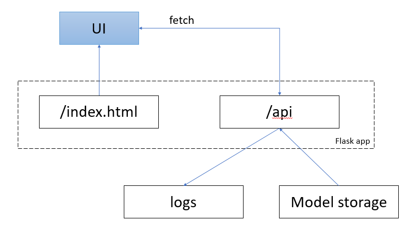

## Housing Price Prediction Model

Лекции и тех задание на семинары доступны на [Я.диске](https://disk.yandex.ru/d/vDb3HPumZ2xK0w)  

Ссылки на свои репо присылайте на ailabintsev@fa.ru  

### Описание проекта
Проект направлен на создание модели машинного обучения для прогнозирования цен на жилье. Модель использует различные характеристики объектов недвижимости для предсказания их рыночной стоимости.

### Структура проекта
```
housing_price_prediction/
├── data/
│   ├── raw/                # Исходные данные
│   ├── processed/          # Обработанные данные
├── models/                 # Обученные модели
├── notebooks/              # Jupyter notebooks
├── service/                # Сервис предсказания цены на недвижимость
│   ├── templates/          # Шаблоны для веб-приложения
│   └── app.py              # Flask приложение
├── src/                    # Исходный код
│   ├── lifecycle.py        # Жизненный цикл модели
│   ├── models.py           # Модели машинного обучения
│   └── utils.py            # Вспомогательные функции
├── requirements.txt        # Требования к зависимостям
└── README.md
```

### Архитектура сервиса ПА



### Как запустить
1. Клонируйте репозиторий:
```bash
git clone https://github.com/labintsev/pabd25.git
```

2. Создайте venv и установите зависимости:
```bash
python -m venv venv
venv/Scripts/activate
pip install -r requirements.txt
```

3. Запустите цикл сбора данных и обучения:
```bash
python src/lifecycle.py --parse_data
```

### Признаки
Используемые данные включают следующие характеристики:
* Площадь жилья
* Количество комнат
* Этаж квартиры
* Этажей в доме

### Модель машинного обучения
** DecisionTreeRegressor ** - дерево решений для регрессии  
max_depth=5  

### Данные
Собраны в период с 16.04.2025 по 14.05.2025  
В выборке 1, 2, 3 комнатные квартиры  
Цена до 100 млн, площадь до 100 м2  

Train - 923 квартиры  
Test - 231 квартира  

### Результаты
После обучения модели  достигаются следующие результаты:
* MAE: 8_230 тыс.р.
* RMSE: 12_301 тыс.р. 
* R² Score train: 0.67
* R² Score test: 0.50

### Использование сервиса предиктивной аналитики в dev mode
1. Запустите сервис с указанием имени модели
```sh
python service/app.py -m model_path
```
2. Веб приложение доступно по ссылке `http://127.0.0.1:5000` 
3. API endpoint доступен  по ссылке `http://127.0.0.1:5000/api/numbers`


### Лицензирование
Этот проект распространяется под лицензией MIT. 
Смотрите файл LICENSE для деталей.

### Контакты
Для вопросов и предложений обращайтесь:

* Email: your.email@example.com
* GitHub: @yourusername
* LinkedIn: linkedin.com/in/yourusername

### Что сделано:
1. Сделала форк оригинального репозитория
2. Настроила конфигурацию git (email/username)
3. Создала виртуальное окружение
4. Активировала виртуальное окружение и установила пакеты


### Модель машинного обучения
1. Линейная регрессия с L1 и L2 регуляризацией  

Я взяла данные по квартирам (площадь, этажность, количество комнат, этаж) и целевую переменную (цену). Затем нормализовала данные через StandardScaler. Для обучения протестировала три модели линейной регрессии с регуляризацией - Ridge, Lasso и ElasticNet, используя GridSearchCV с кросс-валидацией на 5 фолдах для подбора оптимальных гиперпараметров. Лучшую модель выбирала по метрике R².

После выбора модели дообучила её на полном тренировочном наборе, сохранила веса и оценила качество. На тестовых данных модель показала R²=0.72, что говорит о хорошей прогностической способности. Для оценки также использовала метрики MSE, RMSE и MAE в абсолютных значениях цены.

### Данные
Собраны из файла: `1_2025-05-19_23-25.csv`  

Train - 44 квартиры  
Test - 12 квартир  

Примеры данных:
| Параметр       | total_meters | floors_count | price    | rooms_1 | first_floor | last_floor |
|----------------|--------------|--------------|----------|---------|-------------|------------|
| Пример 1       | 45.3         | 31           | 23900000 | True    | False       | False      |
| Пример 2       | 41.0         | 12           | 11500000 | True    | False       | False      |

### Результаты (логистическая регрессия)
После обучения модели достигаются следующие результаты:

**На обучающей выборке:**
* MSE: 113_072_529_740_363.16
* RMSE: 10_633_556.78 руб.
* MAE: 6_885_164.47 руб. 
* R² Score: 0.46

**На тестовой выборке:**
* MSE: 26_888_739_765_963.77  
* RMSE: 5_185_435.35 руб.
* MAE: 4_068_010.64 руб.
* R² Score: 0.72

2. Catboost

С помощью GridSearchCV с кросс-валидацией на 5 фолдах подобрала оптимальные гиперпараметры. Лучшая модель получилась с глубиной деревьев 8, learning_rate=0.1 и L2-регуляризацией.

После подбора параметров дообучила модель с ранней остановкой на 100 примерах, чтобы избежать переобучения. На тренировочных данных модель достигла идеального R²=1.0, а на тестовых - R²=0.43. Такой разрыв между метриками показывает переобучение.


### Результаты (логистическая регрессия)
После обучения модели достигаются следующие результаты:

**На обучающей выборке:**
* MSE: 989,486.72
* RMSE: 994.73
* MAE: 796.70
* R²: 1.00 

**На тестовой выборке:**
* MSE: 53_618_615_464_455.30
* RMSE: 7_322_473.3
* MAE: 5_323_254.21
* R²: 0.43
